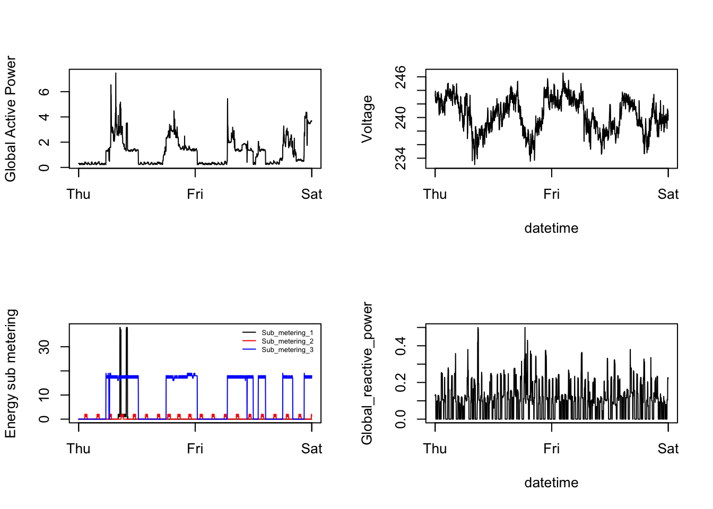

# Plotting Power Consumption
Daniel Maurath  
June, 2014  
###About
This was the first project for the **Exploratory Data Analysis** course in Coursera's Data Science specialization track. The objective was to practice creating plots by reproducing a series of four plots, and also to practice using github by forking and cloning an existing repository.

##Sypnosis
The goal here was simply to examine how household energy usage varies over a 2-day period in February, 2007 by reproducing a series of four plots. Due to specific image size requirements of the new plots, they will look slightly different than the originals. 

##Data
This project used data from the [UC Irvine Machine Learning Repository](http://archive.ics.uci.edu/ml/), a popular repository for machine learning datasets. The "Individual household electric power consumption Data Set" was used and made available on the course web site:

* [Electric power consumption Dataset (20Mb)](https://d396qusza40orc.cloudfront.net/exdata%2Fdata%2Fhousehold_power_consumption.zip)

* Description: Measurements of electric power consumption in
one household with a one-minute sampling rate over a period of almost
4 years. Different electrical quantities and some sub-metering values
are available.

The following descriptions of the 9 variables in the dataset are taken
from the [UCI web site](https://archive.ics.uci.edu/ml/datasets/Individual+household+electric+power+consumption)

<ol>
<li><b>Date</b>: Date in format dd/mm/yyyy </li>
<li><b>Time</b>: time in format hh:mm:ss </li>
<li><b>Global_active_power</b>: household global minute-averaged active power (in kilowatt) </li>
<li><b>Global_reactive_power</b>: household global minute-averaged reactive power (in kilowatt) </li>
<li><b>Voltage</b>: minute-averaged voltage (in volt) </li>
<li><b>Global_intensity</b>: household global minute-averaged current intensity (in ampere) </li>
<li><b>Sub_metering_1</b>: energy sub-metering No. 1 (in watt-hour of active energy). It corresponds to the kitchen, containing mainly a dishwasher, an oven and a microwave (hot plates are not electric but gas powered). </li>
<li><b>Sub_metering_2</b>: energy sub-metering No. 2 (in watt-hour of active energy). It corresponds to the laundry room, containing a washing-machine, a tumble-drier, a refrigerator and a light. </li>
<li><b>Sub_metering_3</b>: energy sub-metering No. 3 (in watt-hour of active energy). It corresponds to an electric water-heater and an air-conditioner.</li>
</ol>

##Data Loading and Preprocessing

```r
if(!file.exists("exdata-data-household_power_consumption.zip")) {
        temp <- tempfile()
        download.file("http://d396qusza40orc.cloudfront.net/exdata%2Fdata%2Fhousehold_power_consumption.zip",temp)
        file <- unzip(temp)
        unlink(temp)
}
power <- read.table(file, header=T, sep=";")
power$Date <- as.Date(power$Date, format="%d/%m/%Y")
df <- power[(power$Date=="2007-02-01") | (power$Date=="2007-02-02"),]
df$Global_active_power <- as.numeric(as.character(df$Global_active_power))
df$Global_reactive_power <- as.numeric(as.character(df$Global_reactive_power))
df$Voltage <- as.numeric(as.character(df$Voltage))
df <- transform(df, timestamp=as.POSIXct(paste(Date, Time)), "%d/%m/%Y %H:%M:%S")
df$Sub_metering_1 <- as.numeric(as.character(df$Sub_metering_1))
df$Sub_metering_2 <- as.numeric(as.character(df$Sub_metering_2))
df$Sub_metering_3 <- as.numeric(as.character(df$Sub_metering_3))
```
##Plot 1


##My Plot 1

```r
plot1 <- function() {
        hist(df$Global_active_power, main = paste("Global Active Power"), col="red", xlab="Global Active Power (kilowatts)")
        dev.copy(png, file="plot1.png", width=480, height=480)
        dev.off()
        cat("Plot1.png has been saved in", getwd())
}
plot1()
```

 

```
## Plot1.png has been saved in /Users/dmaurath/Documents/JHDS/datasciencecoursera/Exploratory Data Analysis Projects/Plotting 1
```
##Plot 2


##My Plot 2

```r
plot1 <- function() {
        plot(df$timestamp,df$Global_active_power, type="l", xlab="", ylab="Global Active Power (kilowatts)")
        dev.copy(png, file="plot2.png", width=480, height=480)
        dev.off()
        cat("plot2.png has been saved in", getwd())
}
plot1()
```

 

```
## plot2.png has been saved in /Users/dmaurath/Documents/JHDS/datasciencecoursera/Exploratory Data Analysis Projects/Plotting 1
```
##Plot 3


##My Plot 3

```r
plot3 <- function() {
        plot(df$timestamp,df$Sub_metering_1, type="l", xlab="", ylab="Energy sub metering")
        lines(df$timestamp,df$Sub_metering_2,col="red")
        lines(df$timestamp,df$Sub_metering_3,col="blue")
        legend("topright", col=c("black","red","blue"), c("Sub_metering_1  ","Sub_metering_2  ", "Sub_metering_3  "),lty=c(1,1), lwd=c(1,1))
        dev.copy(png, file="plot3.png", width=480, height=480)
        dev.off()
        cat("plot3.png has been saved in", getwd())
}
plot3()
```

 

```
## plot3.png has been saved in /Users/dmaurath/Documents/JHDS/datasciencecoursera/Exploratory Data Analysis Projects/Plotting 1
```

##Plot 4


##My Plot 4

```r
plot4 <- function() {
        par(mfrow=c(2,2))
        
        ##PLOT 1
        plot(df$timestamp,df$Global_active_power, type="l", xlab="", ylab="Global Active Power")
        ##PLOT 2
        plot(df$timestamp,df$Voltage, type="l", xlab="datetime", ylab="Voltage")
        
        ##PLOT 3
        plot(df$timestamp,df$Sub_metering_1, type="l", xlab="", ylab="Energy sub metering")
        lines(df$timestamp,df$Sub_metering_2,col="red")
        lines(df$timestamp,df$Sub_metering_3,col="blue")
        legend("topright", col=c("black","red","blue"), c("Sub_metering_1  ","Sub_metering_2  ", "Sub_metering_3  "),lty=c(1,1), bty="n", cex=.5) #bty removes the box, cex shrinks the text, spacing added after labels so it renders correctly
        
        #PLOT 4
        plot(df$timestamp,df$Global_reactive_power, type="l", xlab="datetime", ylab="Global_reactive_power")
        
        #OUTPUT
        dev.copy(png, file="plot4.png", width=480, height=480)
        dev.off()
        cat("plot4.png has been saved in", getwd())
}
plot4()
```

 

```
## plot4.png has been saved in /Users/dmaurath/Documents/JHDS/datasciencecoursera/Exploratory Data Analysis Projects/Plotting 1
```
